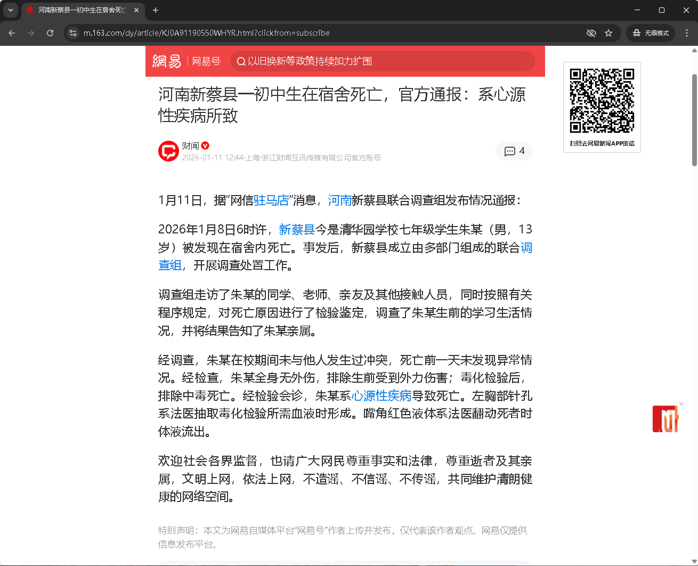
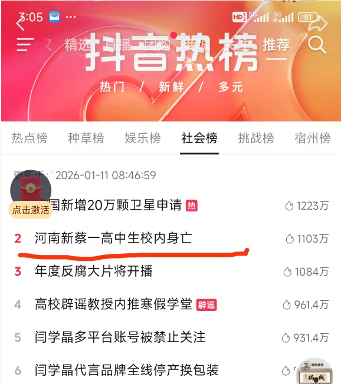
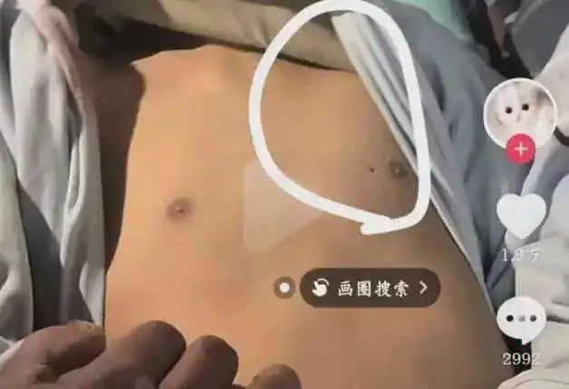
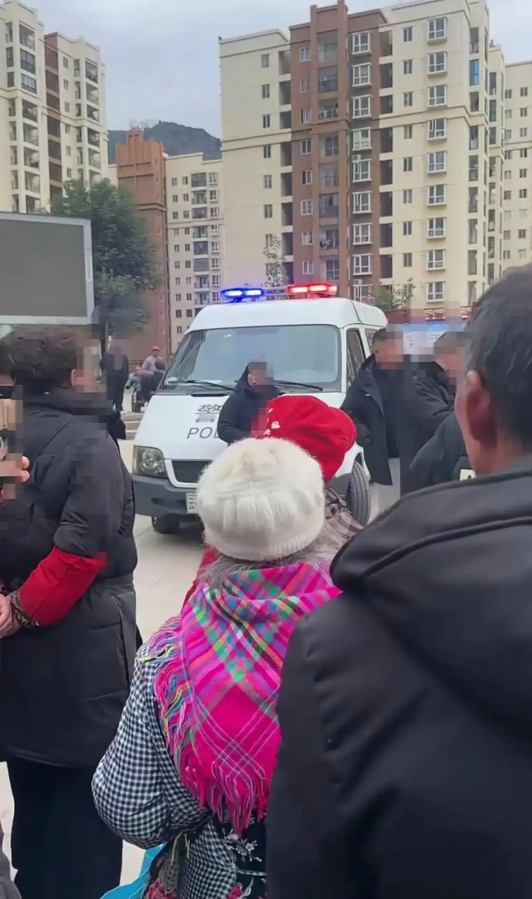
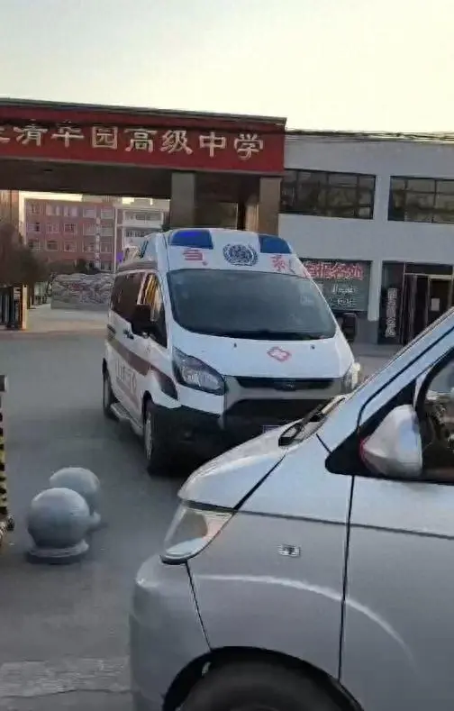
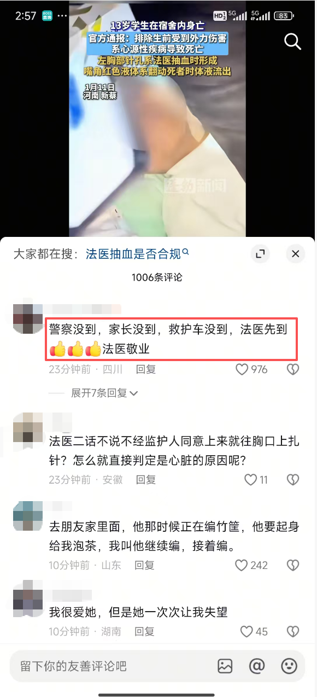
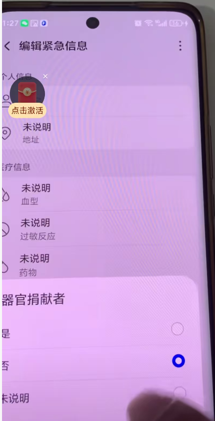
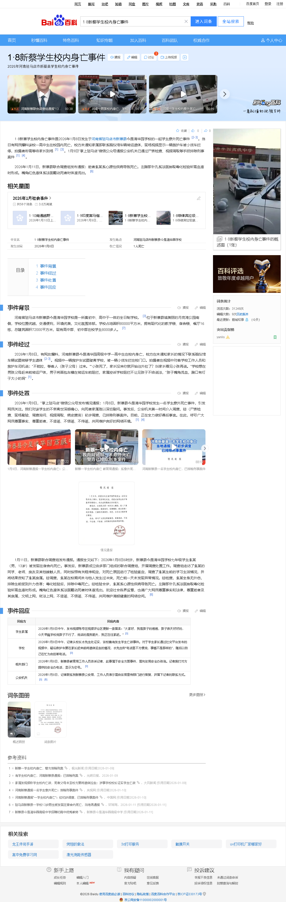

# 河南新蔡县一初中生在宿舍死亡，官方通报：系心源性疾病所致



# 一：简介
- 2026年1月8日发生于河南省驻马店市新蔡县今是清华园学校的一起学生意外死亡事件 。 当日有网民爆料该校一高中生在校园内死亡，校方未通知家属即联系殡仪馆车辆转运遗体，现场视频显示一辆救护车被小货车拦停，拍摄者称需等待家长到场。
- 2026年1月9日“掌上驻马店”微信公众号通报公安机关已通过尸表检查、视频调取等手段排除刑事案件。
- 2026年1月11日新蔡县联合调查组发布通报：逝者朱某系心源性疾病导致死亡。左胸部针孔系法医抽取毒化检验所需血液时形成。嘴角红色液体系法医翻动死者时体液流出。
  
  
 
# 二：事件经过
2026年1月8日，有网友爆料，河南新蔡县今是清华园高级中学一高中生在校内身亡，校方在未通知家长的情况下联系殡仪馆车辆试图转移学生遗体。
视频中一辆救护车试图驶离学校，被一辆小货车拦在校门口。拍摄者在视频中对着学校工作人员和救护车司机说：“不能拉，等着人（孩子父母）过来。”，“小孩死了，家长没来你就开始往外拉了？叫家长看见小孩再说。
”学校想在男孩父母赶来前转运尸体，男子将面包车横在转运车前阻拦，家属控诉学校阻拦不让见孩子不给说法，“孩子嘴角流血，胸口有钉子大小的洞” 。


# 三：事件处置
2026年1月9日，“掌上驻马店”微信公众号发布情况通报：1月8日，新蔡县今是清华园学校发生一名学生意外死亡事件，引发网民关注。
我们对该学生的不幸离世深感痛心，向死者家属致以深切慰问。事发后，公安机关第一时间介入调查，经（尸表检查、现场勘验、调查询问、视频调取、病史查询）初步调查，已排除刑事案件。
目前，正在全力做好善后事宜。在此，呼吁广大网民尊重事实、尊重逝者，不造谣、不信谣、不传谣，共同维护良好的网络环境。


# 四：事件回应

| 回应方 | 回应内容 |
|--------|----------|
| 学生家属 | 2026年1月8日中午，发布视频账号在视频评论区更新一条留言：“大家好，我是孩子的爸爸，孩子昨天好好的，今天早晨学校说孩子不行了，说话的是我姐夫，我正在往家赶。” |
| 学校 | 2026年1月8日中午，记者从校长水先生处证实，该校确有发生学生亡故事件。对于学生家长通过社交平台发布的视频中，疑似救护车要在家长赶来前将遗体运走的情况，水先生称“电话里不方便说，事情不是那样的”，随后以自己在忙为由挂断电话。 |
| 相关部门 | 2026年1月8日，新蔡县教育局工作人员告诉记者，此事属于安全方面事件，需向该局安全办咨询。记者拨打对方提供的安全办电话，显示为空号。 |
| 公安机关 | 2026年1月8日，记者联系到新蔡县公安局，工作人员表示需由该局宣传部门进行答复，并留下记者的联系方式。  |

# 五：后续处理
1. 学校放假。

# 六：公众疑问
1. 有网友质疑：“警察没到，家长没到，救护车没到，法医先到法医敬业”。

2. 在学校喝水都要收费，为何频频体检却免费？
3. 120是否有权拉送遗体？AI给出的回答是：
- 一般情况下：
    - 120急救车主要负责运送活着的病人
    - 对于已经确认死亡的遗体，通常应由殡仪馆的专业车辆运送
    - 急救人员确认患者死亡后，一般会通知家属联系殡仪馆
- 特殊情况：
    - 在某些紧急情况下，如需要将遗体运往医院进行尸检
    - 涉及刑事案件需要保护现场证据时
    - 经相关部门批准的特殊情况
4. 部分手机中有捐献器官的设置。

   
5. 罗翔老师曾用一个思想实验阐述生命价值不可比较的观点
> 假设医院里有五位器官衰竭的患者，每人需要一个特定器官移植（如心、肝、肺、脾、肾）才能存活，而恰好一位身体健康但智力较低的人路过，其器官恰好能救这五人。‌
‌罗翔老师指出，‌ 如果接受“牺牲一人救多人”的逻辑，就会陷入功利主义陷阱，即开始对生命进行价值排序——例如以智商高低衡量人的“有用性”。
这种比较看似能最大化效益，实则危险：一旦标准被接受，每个人都有可能因某种缺陷（如智力、健康或社会地位）成为被牺牲的“少数”。
他强调，‌生命的价值是绝对的，不能量化比较‌，否则会动摇人权的基石，导致弱势群体被系统性物化。‌
‌从伦理角度看，‌ 这个例子批判了工具化生命的倾向。现实中，器官捐献必须基于自愿原则，任何强制或比较性决策都构成道德和法律的双重越界。
罗翔老师借此提醒公众，‌维护平等尊重的生命观，是文明社会的底线‌。‌
6. 抖音中也出现了很多车贴“天下为公”。
7. 抖音中“星星点灯”配音增多： ```现在的一片天 是肮脏的一片天 星星在文明的天空里再也看不见 。```
8. 信任再一次被挑战。


# 七：相关链接
- https://baike.baidu.com/item/1·8新蔡学生校内身亡事件/67197639
  )